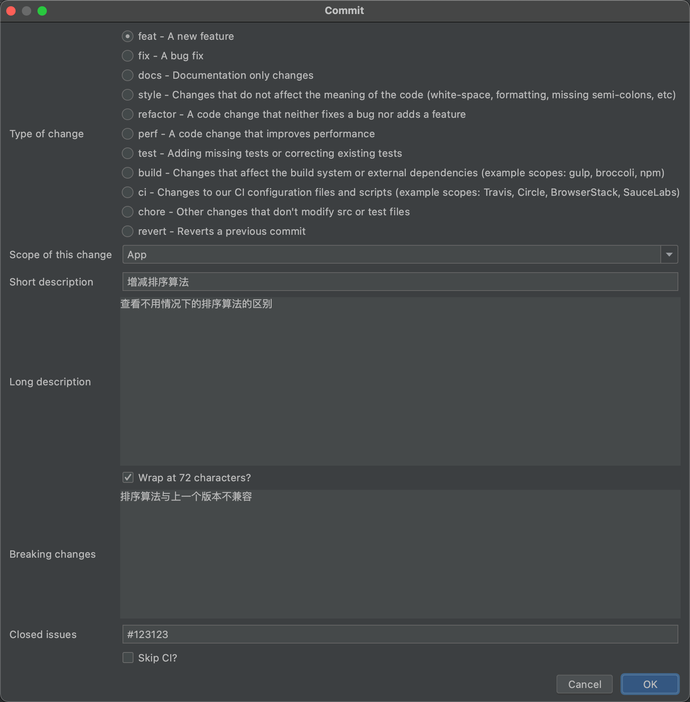

# 代码审核规范

# 一、开发者

1. 不应该在 CI 内同时包含主要风格的改动与其他代码的修改，这样会导致难以看出 CI 到底做出什么改动
2. 格式化 commit message
3. 提交 PR 时简单讲解本次 review 部分的业务逻辑和影响范围，方便参与者检查出 bug

优势：

1. 提供更多的历史信息，方便快速浏览;
2. 可以过滤某些 commit（比如文档改动），便于查找信息;
3. 可以直接从 commit 生成 change log。

格式：

commit message 都包含三个部分：Header（必需）、Body（可选）、Footer（可选）

```
<type>(<scope>): <subject>
<BLANK LINE>
<body>
<BLANK LINE>
<footer>
```


Header 部分只有一行，三个字段：type（必需）、scope（可选）、subject（必需）

**type** 用于说明commit的类别，只允许使用下面7个标识

- feat：新功能（feature）
- fix：修复bug
- docs：文档
- style：格式（不影响代码运行的变动）
- refactor：重构（既不是新增功能，也不是修改bug的代码变动）
- perf：提高性能的改动，不改变逻辑
- test：增加测试
- build：构造工具的或者外部依赖的改动
- ci：改变关于 ci 的配置、脚本或者依赖
- chore：构建过程或辅助工具的变更
- revert：回退上一个版本

**scope** 用户说明 commit 影响的范围，比如数据层、控制层、视图层等
**subject** 是 commit 目的的简短描述，不超过50个字符

**body** 部分是对本次 commit 的详细描述，可以分成多行

**footer** 部分只用于两种情况：1、不兼容变动；2、关闭issue


> 扩展：如果你使用 IDEA 进行编码，可以是使用 `git commit template` 插件来规范每次提交的 commit message 信息



格式化后的代码 message 为：

```
feat(App): 增减排序算法

查看不用情况下的排序算法的区别

BREAKING CHANGE: 排序算法与上一个版本不兼容

Closes #123123
```


# 二、评审者

checklist

- 设计：代码是否经过精心设计并适合你的系统？
- 功能：代码是否符合开发者意图？
- 复杂性：代码是否可以更简洁？未来其他开发者接手时，代码是否易于理解与易用？
- 测试：代码是否经过正确且设计良好的自动化测试？
- 命名：开发人员是否为变量、类、方法等选择了明确的名称？
- 注释：注释是否清晰有效？
- 风格：代码是否遵循了代码开发规范？
- 文档：开发人员是否也同步更新了相关文档？

1. 在评论前加上“nit:”这样的前缀，表明这是一个优化性的建议，可以不影响本次上线
2. 应在一个工作日内完成评审，并给出意见
3. 评价只针对代码和具体业务流程


# 三、原则

### 1.对事不对人

大家是同事，在一个团队工作和气很重要。不要在 Code Review 中说 “ 你写的和 shit 一样，我看都不想看” 这种话，你可以直接指出问题，而不是直接评价。比如你可以说 “ 这个变量名不好理解，咱们换成XXX是不是更好 ”。

可以参考《非暴力沟通》


### 2. 每个 Review 至少给一条正面评价

Code Review 本意是改善代码质量，增强团队成员之间的沟通，但是我一提交代码就有人说我写的垃圾，这很打击自信心啊，也不利于团队成员和平相处。代码有问题，指出问题是必须的，要实事求是，但是有的时候也需要给队友一点鼓励，例如简单的或者“赞一个”我都很开心了。


### 3. 用工具进行基础问题的自动化检查

用 Tab 还是空格，用两个空格还是四个空格，函数后面怎么换行等基础问题检查，可以使用 IDEA的一些代码检测工具进行，团队成员应该把更多精力放在代码规范，代码性能优化等地方。


### 4. 全员参加 Code Review，并设定各部分负责人

扩大 Code Review 参与面，参与不是说一定去审核别人的代码，可以是代码被审核，也可以是看别人审核意见，这都是学习的过程。并且每部分设定负责人，该负责人对这部分代码质量负责，负责人需要是资深工程师。全员参与 Code Review 可以让团队成员更快的成长，新人在看大佬 Review 代码的过程就能学到很多。


### 5. 每次Code Review的量不宜太多

Code Review 效果和质量与 PR 代码量成反比，你一下提交这么多代码，我今天还下不下班了？ 我女朋友你帮我陪？每次 PR 代码量小一些，看起来速度快，又不至于失去耐心，这样才能达到 Code Review 的效果，所以要经常进行 Code Review，但是每个 PR 代码量要少。


### 6. 在写新代码之前，先Review 掉需要评审的代码

你让我去 Review 一周前的代码？我还得把思维和项目进度切换到一周前？大家肯定不愿意，所以要形成规定，写新代码之前先把旧的 Review 掉，提交 PR 的时候也保证代码量小，这样 Review 起来不需要大块时间，改起来也快。不能因为 Code Review 大幅耽误项目进度，进度是全团队的事，不是某个人的事。


### 7. 如果你有更好的方案，尽管提出来

在 Code Review 中经常会发现写的不好的地方，如果你有更好的方法，欢迎提出来！首先能改进这个 PR 的代码，其次能体现你的能力，团队应该定期对这种提出好的解决方案的同事进行奖励。


### 8. 不要在 review 中讨论需求，review 就是 review

不要在 Code Review 里搞别的，有需要就另安排时间进行，要明确 Code Review 是完善代码，不是需求和功能讨论，始终要以代码质量为中心。


# 四、小项目团队内部采用轮换 review 的方式

通过团队内部轮流 review 来帮助团队成员对项目整体流程和代码的认知，通过一次一次 review 来提高每个成员对整个项目的大体流程、细节的熟悉程度，减少因为不熟悉代码导致的重复逻辑开发，减少写重复代码的概率。

通过审核别人的代码，也能发现一些自己的一些缺点，有则改之，无则加勉。


